<!-- Header Layout: Profile Card & Terminal Text Card -->
<table border="0" cellpadding="0" cellspacing="0">
  <tr>
    <td valign="top" width="500">
      
    </td>
    <td valign="top" width="564">
      
    </td>
  </tr>
</table>

 

<!-- Profile Title & Introduction -->
# 🧬 Prince Singh 💻

**Hi, I'm Prince. A Biology student driven by deep tech curiosity, operating in the realms of Ethical Hacking and Full-Stack Development.**

---

<!-- Primary CTA Badge (Vercel Black/White) -->

  

<!-- Social & Portfolio Badges (Official App Colors) -->

  
  
  
  

<!-- GitHub Stats & Views Badges (GitHub Theme Matching) -->

  
  

 

<!-- Bottom Contribution Graph Wrap -->
<table width="100%" border="0" cellpadding="0" cellspacing="0">
  <tr>
    <td align="center">
      
    </td>
  </tr>
</table>

